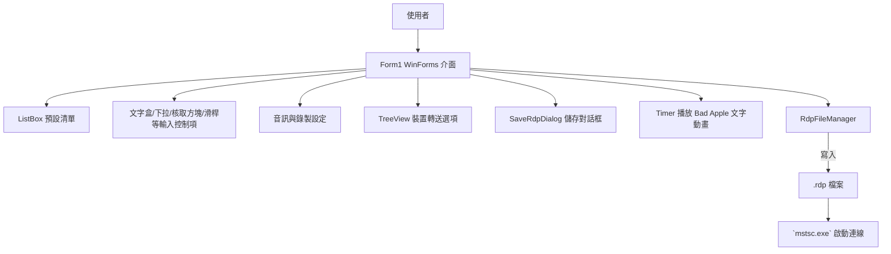

# BetterRDPLauncher

BetterRDPLauncher 是一個以 C# Windows Forms 撰寫的遠端桌面連線啟動器，提供預設連線管理、視訊/音訊/裝置轉送設定與彩蛋式的 Bad Apple 文字動畫播放。程式會把使用者輸入的主機、帳號、密碼與顯示設定轉換成 `.rdp` 檔，並交由 `mstsc.exe` 啟動遠端桌面。

## 系統架構 (Mermaid)



## 操作流程 (Mermaid)

```mermaid
flowchart LR
    start([啟動程式]) --> fill[填寫主機/帳號/密碼與顯示設定]
    fill --> resources[選擇音訊與裝置轉送]
    resources --> save{儲存預設?}
    save -- 是 --> dialog[輸入檔名與是否儲存密碼]
    dialog --> writeRdp[建立 .rdp 檔]
    save -- 否 --> skip[直接使用現有設定]
    writeRdp --> launch[呼叫 mstsc.exe 連線]
    skip --> launch
    launch --> cleanup[5 秒後自動刪除暫存檔]
    cleanup --> end([結束或關閉程式])
```

## 功能概述

- **預設管理與連線**：以 `ListBox` 呈現已儲存的連線預設，能新增、修改、刪除並一鍵啟動遠端桌面；暫存 `.rdp` 檔於啟動後自動清理。密碼使用 DPAPI 加密後寫入 `password 51:b:` 欄位。【F:remote_window/Form1.cs†L204-L286】【F:remote_window/Form1.cs†L625-L868】
- **顯示/音訊/裝置設定**：透過 `TrackBar`、`CheckBox`、`RadioButton`、`TreeView` 等控制項設定解析度、全螢幕、多螢幕、色彩深度、音訊播放/錄音模式與剪貼簿、印表機、智慧卡、磁碟機等轉送選項。【F:remote_window/Form1.Designer.cs†L33-L206】【F:remote_window/Form1.cs†L287-L373】【F:remote_window/Form1.cs†L529-L612】
- **Bad Apple 彩蛋**：在 About 分頁啟動 `Timer`，以巢狀迴圈逐格讀取文字檔影格、以 `break/continue` 控制缺漏補償與重頭播放，將內容顯示到 `RichTextBox`。【F:remote_window/Form1.cs†L374-L459】【F:remote_window/Form1.Designer.cs†L117-L191】【F:remote_window/Form1.Designer.cs†L199-L206】
- **友善輸入**：可顯示/隱藏主機與密碼欄位文字；連線資訊全由鍵盤/滑鼠輸入取得，不需在程式碼硬編，符合課程實作要求。【F:remote_window/Form1.cs†L613-L715】

## 視窗元件種類清單

- Form、TabControl、TabPage、GroupBox、Panel、Label、PictureBox、Button、ListBox、ListView（無）、RichTextBox、LinkLabel。【F:remote_window/Form1.Designer.cs†L24-L206】
- TextBox、ComboBox、NumericUpDown、TrackBar、CheckBox、RadioButton、TreeView，用於輸入與切換設定。【F:remote_window/Form1.Designer.cs†L53-L170】
- Timer：`timer1` 以固定節奏播放 Bad Apple 文字影格。【F:remote_window/Form1.Designer.cs†L112-L119】
- MessageBox：所有檔案儲存、刪除、錯誤與提示皆使用 `MessageBox.Show` 回饋給使用者。【F:remote_window/Form1.cs†L731-L868】
- SaveRdpDialog 內的 Label、TextBox、CheckBox、Button（確定/取消）協助輸入新預設名稱與是否儲存密碼。【F:remote_window/SaveRdpDialog.Designer.cs†L1-L79】

## 巢狀迴圈與 break/continue 使用說明

- **巢狀迴圈位置**：`timer1_Tick` 內以 `for` 外迴圈限制當次嘗試次數，內部 `while` 迴圈逐一尋找下一個 Bad Apple 影格檔案。外迴圈避免無窮迴圈，內迴圈則在找到有效檔案後 `break` 離開，以確保單一影格只顯示一次。【F:remote_window/Form1.cs†L395-L432】
- **break/continue 的用途**：播放過程若找到影格就 `break` 結束內層迴圈；缺漏影格或讀檔例外時以 `continue` 跳過並遞增索引，連續缺漏達閾值會重設回第 1 張並繼續搜尋，確保 Bad Apple 播放能從頭迴圈不斷展示。【F:remote_window/Form1.cs†L425-L459】

## 期末專案評分規則對照

- 專案可執行、所有輸入（主機、帳號、密碼、選項）皆由鍵盤或滑鼠填入 UI 控制項，未硬編於程式碼，符合「可執行且輸入必須來自鍵盤/滑鼠」的基本門檻。【F:remote_window/Form1.Designer.cs†L33-L206】【F:remote_window/Form1.cs†L613-L715】
- 視窗元件種類超過 5 種（含 TabControl、TrackBar、TreeView、RichTextBox、NumericUpDown、MessageBox、Timer 等），滿足最低 60 分的「元件種類」與額外加分條件。
- 已使用巢狀迴圈與 break/continue 於 Bad Apple 播放邏輯，滿足迴圈與流程控制條件。【F:remote_window/Form1.cs†L395-L459】
- 使用多個 `SaveRdpFile` 等方法封裝行為，亦有 `else if` 判斷解析 `.rdp` 內容，符合 Function 與 else if 條件。【F:remote_window/Form1.cs†L203-L345】【F:remote_window/Form1.cs†L543-L589】
- 創意/美觀/完整度：具備彩蛋式動畫、DPAPI 加密與預設管理，並使用系統圖示與圖片提升介面識別度，供教師與同學評分，最終教師佔 70%、同學佔 30%（不可評自己組別），並需上傳程式碼與 PPT，封面包含課程、教師、題目與全體組員班級姓名學號。

評分細節（原文）：

```
Final Project 務必能確實執行，不能執行者，並且輸入值一律從鍵盤或滑鼠輸入，不能直接寫在程式碼上。程式不能執行，或輸入值不是從鍵盤或滑鼠輸入的，一律0分。
在確定Final Project 可以確實執行，並且輸入值可以從鍵盤或滑鼠輸入後，尚須滿足下面所有條件，始得60分。缺少一個扣10分。
視窗元件種類：至少5種（請注意，這邊是5種，不是5個）
至少包含一個Nest Loop
需用到Break或Continue 其中一個
至少包含一個Function
至少包含一個else if or switch case
剩下20分，以每增加一種視窗元件多5分，加總後至多80分。
剩下20分為創意、美觀、完整度、報告流暢度等。
總成績部分，老師佔70%，同學們佔30%，也就是老師只多給0~70分，同學們至多給0~30分。
每位同學都要評分，但不評自己組的成績。
所以同學都要把Final Project的程式碼專案及PPT檔上傳至i-Plus學園。
投影片封面務必包含課程名稱、授課教師姓名、Final Project題目，以及所有組員的班級、姓名、學號。
```
