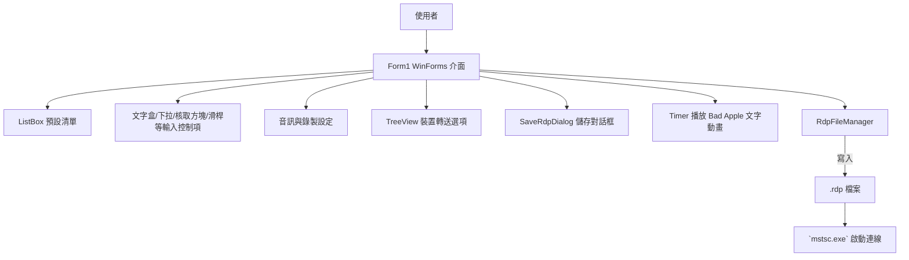
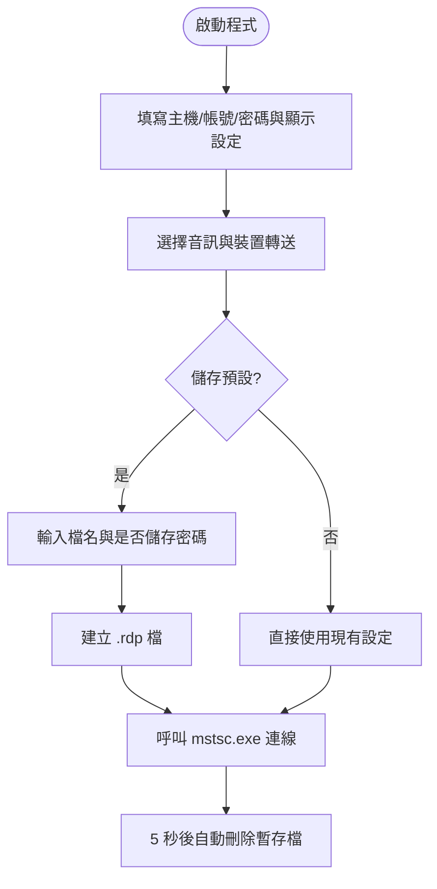

# BetterRDPLauncher

BetterRDPLauncher 是一個以 C# Windows Forms 撰寫的遠端桌面連線啟動器，提供預設連線管理、視訊/音訊/裝置轉送設定與彩蛋式的 Bad Apple 文字動畫播放。程式會把使用者輸入的主機、帳號、密碼與顯示設定轉換成 `.rdp` 檔，並交由 `mstsc.exe` 啟動遠端桌面。

## 系統架構 (Mermaid)

## 操作流程 (Mermaid)

## 功能概述

- **預設管理與連線**：以 `ListBox` 呈現已儲存的連線預設，能新增、修改、刪除並一鍵啟動遠端桌面；暫存 `.rdp` 檔於啟動後自動清理。密碼使用 DPAPI 加密後寫入 `password 51:b:` 欄位。
- **顯示/音訊/裝置設定**：透過 `TrackBar`、`CheckBox`、`RadioButton`、`TreeView` 等控制項設定解析度、全螢幕、多螢幕、色彩深度、音訊播放/錄音模式與剪貼簿、印表機、智慧卡、磁碟機等轉送選項。
- **友善輸入**：可顯示/隱藏主機與密碼欄位文字；連線資訊全由鍵盤/滑鼠輸入取得，不需在程式碼硬編，符合課程實作要求。

## 視窗元件種類清單

- TabControl、TabPage、GroupBox、Panel、Label、PictureBox、Button、ListBox、RichTextBox、LinkLabel。
- TextBox、ComboBox、NumericUpDown、TrackBar、CheckBox、RadioButton、TreeView，用於輸入與切換設定。
- Timer：`timer1` 以固定節奏播放文字影格。
- MessageBox：所有檔案儲存、刪除、錯誤與提示皆使用 `MessageBox.Show` 回饋給使用者。】
- 總共 **19 種** 元件

## 巢狀迴圈與 break/continue 使用說明

- **巢狀迴圈位置**：`timer1_Tick` 內以 `for` 外迴圈限制當次嘗試次數，內部 `while` 迴圈逐一尋找下一個 Bad Apple 影格檔案。外迴圈避免無窮迴圈，內迴圈則在找到有效檔案後 `break` 離開，以確保單一影格只顯示一次。
- **break/continue 的用途**：播放過程若找到影格就 `break` 結束內層迴圈；缺漏影格或讀檔例外時以 `continue` 跳過並遞增索引，連續缺漏達閾值會重設回第 1 張並繼續搜尋，確保 Bad Apple 播放能從頭迴圈不斷展示。

## 期末專案評分規則對照

- 專案可執行、所有輸入（主機、帳號、密碼、選項）皆由鍵盤或滑鼠填入 UI 控制項，未硬編於程式碼，符合「可執行且輸入必須來自鍵盤/滑鼠」的基本門檻。
- 視窗元件種類超過 5 種（含 TabControl、TrackBar、TreeView、RichTextBox、NumericUpDown、MessageBox、Timer 等），滿足最低 60 分的「元件種類」與額外加分條件。
- 已使用巢狀迴圈與 break/continue 於 Bad Apple 播放邏輯，滿足迴圈與流程控制條件。
- 使用多個 `SaveRdpFile` 等方法封裝行為，亦有 `else if` 判斷解析 `.rdp` 內容，符合 Function 與 else if 條件。
- 創意/美觀/完整度：具備彩蛋式動畫、DPAPI 加密與預設管理，並使用系統圖示與圖片提升介面識別度。
